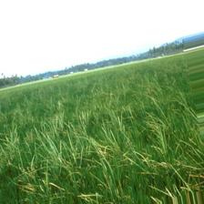
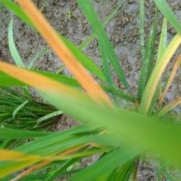
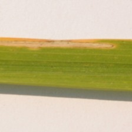
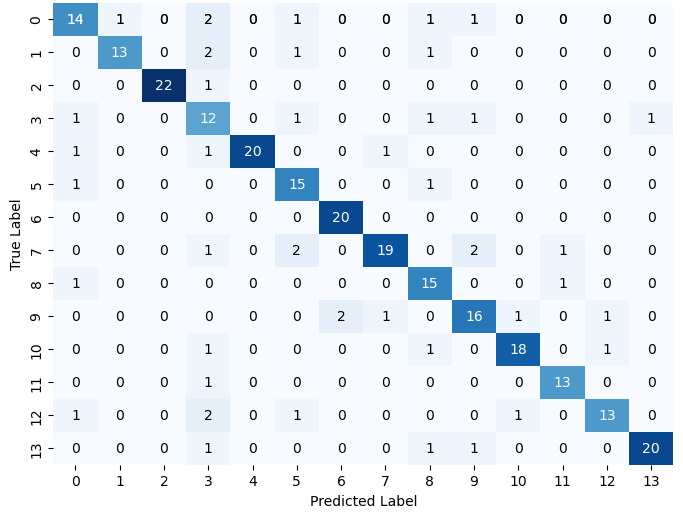
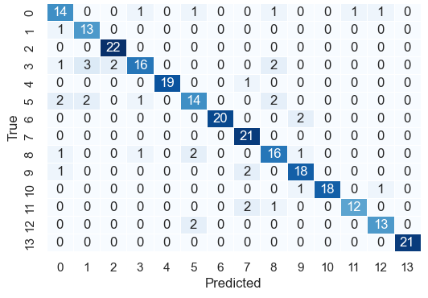

# Optimizing rice disease classification: A comparative study of different color, shape and texture features
<a href="https://doi.org/10.1109/ICCI60780.2024.10532443" target="blank">
    
</a>

**Published in:** [2024 IEEE International Conference on Cybernetics and Innovations (ICCI)](https://ieeexplore.ieee.org/xpl/conhome/10532250/proceeding)  
**Year:** 2024  
**Conference Location:** Chonburi, Thailand  

## Overview


Rice, often considered the staple of life in the Philippines, plays an integral role in the country's culture and sustenance. With a staggering domestic consumption of 16.5 million metric tons of milled rice in 2023, the reliance on this crop is undeniable. However, global rice production faces significant challenges from diseases which can cause yield losses of up to 70%, particularly when they strike early in the crop's life cycle. Effective rice disease management, therefore, relies heavily on early classification and forecasting systems that enable strategic interventions to minimize yield losses, reduce environmental impacts, and support sustainable agriculture. The integration of image processing and machine-driven systems is emerging as a vital solution to address the challenges of accurate disease classification.

This project introduces a novel and efficient approach for classifying 13 rice diseases, as compared to the usual 2-3 diseases focused by local and international studies, by analyzing entire images without requiring complex pre-processing and segmentation steps. By leveraging global image features, including color, shape, and texture, the study trained SVM and ANN models, achieving classification accuracies of **86.23%** and **83.93%**, respectively. 

The detailed dataset, methodology, and results will be discussed in the following sections.
- [Dataset](#dataset)
- [Feature Extraction and Processing](#feature-extraction-and-processing)
- [Training and Tuning](#training-and-tuning)
- [Experiments](#experiments)
- [Results and Discussion](#results-and-discussion)
- [Conclusion and Recommendations](#conclusion-and-recommendations)
- [References](#references)
- [Citation](#citation)

You may also check the [slide deck](https://github.com/josh-rdc/Optimizing-Rice-Disease-Classification-Method/tree/main/Deck).

## Dataset
The dataset used in this study was retrieved from [Kaggle, originally from Omdena’s Local Chapter project- Creating a Rice Disease Classifier using Open Source Data and Computer Vision](https://www.kaggle.com/datasets/shrupyag001/philippines-rice-diseases), comprises two folders, namely `extra_resized_raw_images` and `resized_raw_images`, each containing diverse images of rice plants (paddy images, zoomed-in images, processed images) with samples shown below. 
| **paddy**               | **zoomed-in** | **processed** |
|---------------------------|------------------|-----------------------|
|  |  |  |

All images are standardized to a dimensionality of 224 × 224 pixels. Within the dataset, there are 13 distinct rice diseases categorized into three groups:
1. **Fungal**: Affects the leaf blade, sheath, stem, node, and panicle.
2. **Bacterial**: Affects the leaf blade.
3. **Viral**: Affects the leaf blade and sheath.

The `resized_raw_images` folder, which consists of original images for all 14 classes, including 13 diseases and 1 healthy class, was utilized. This subset has undergone cleaning and evaluation by other users, ensuring the removal of near-duplicate images from different classes. 

<details close>
<summary>Images per class</summary>

The dataset, as summarized in below, is balanced across the classes, providing a comprehensive representation of the different rice plant conditions.

| **Disease**               | **Class Number** | **Number of Images** |
|---------------------------|------------------|-----------------------|
| Bacterial leaf blight     | 0                | 97                    |
| Bacterial leaf streak     | 1                | 99                    |
| Bakanae                   | 2                | 100                   |
| Brown spot                | 3                | 100                   |
| Grassy stunt virus        | 4                | 100                   |
| Healthy rice plant        | 5                | 100                   |
| Narrow brown spot         | 6                | 98                    |
| Ragged stunt virus        | 7                | 100                   |
| Rice blast                | 8                | 98                    |
| Rice false smut           | 9                | 99                    |
| Sheath blight             | 10               | 98                    |
| Sheath rot                | 11               | 91                    |
| Stem rot                  | 12               | 100                   |
| Tungro virus              | 13               | 100                   |
</details>

## Feature Extraction and Processing
The jpeg images were translated to BGR images before converting to the needed color space to extract the input features for the model. The conversion was done by making use of [OpenCV’s CV2](https://docs.opencv.org/3.4/de/d25/imgproc_color_conversions.html). Specific details of the color spaces used to extract each feature are detailed in the table below:

 | **Feature Type**               | **Color Space** | **Details** |
|---------------------------|------------------|-----------------------|
| Texture |	Grayscale |	Derived from the Grey Level Co-occurrence Matrix (GLCM) which were extracted using the [Mahotas library](https://mahotas.readthedocs.io/en/latest/features.html). These features encodes patterns such as contrast, correlation, energy, and homogeneity. |
| Color Histogram |	RGB, HSV, LAB | Provides pixel distribution across color spaces which were split into individual channels. Calculated by computing the number of pixels for each histogram bins. |
| Color Moments |	RGB, HSV, LAB |	Offers compact color representation through statistical measures such as mean, variance, skewness, and kurtosis. Each value were computed for each channel using [NumPy](https://numpy.org/). |
| Zernike and Legendre Moments | Grayscale, HSV	| Orthogonal moments known to their effectiveness as   invariant shape descriptors. Vectors were extracted using [Mahotas Features](https://mahotas.readthedocs.io/en/latest/features.html) for Zernike and [SciPy](https://docs.scipy.org/doc/scipy/reference/generated/scipy.special.legendre.html) for Legendre. |

All the feature are then concatenated into a single dataframe and normalized using [Scikit-learn’s MinMax Scaler](https://scikit-learn.org/stable/modules/generated/sklearn.preprocessing.MinMaxScaler.html). The class names are then converted into integers for model training using [Scikit-learn’s Label Encoder](https://scikit-learn.org/stable/modules/generated/sklearn.preprocessing.LabelEncoder.html) to create the final dataframe.

## Training and Tuning

### Artificial Neural Network (ANN)
The implementation of the ANN was carried out using [Keras from TensorFlow](https://www.tensorflow.org/guide/keras). Initially, a simple model was created with default architecture settings and hyperparameters. This model was trained using the training dataset and evaluated using the test dataset with complete features. 

Subsequently, Principal Component Analysis (PCA) was applied to select a subset of the best features from the initial dataset. These refined features were then used for a second evaluation of the model. Finally, the hyperparameters were tuned using [KerasTuner’s Hyperband](https://keras.io/api/keras_tuner/tuners/hyperband). The model with the tuned hyperparameters was trained on the training dataset and tested using the refined features. 

The hyperparameter configurations are shown below:

| **Hyperparameter**         | **Values**                 |
|-----------------------------|----------------------------|
| Number of Hidden Layers     | 1 to 3                    |
| Nodes per Hidden Layer      | 32 to 512                 |
| Activation Functions        | relu, tanh, sigmoid       |
| Learning Rate               | 0.001, 0.01, 0.1, 0.3, 0.5 |
| Batch Size                  | 16, 32, 64, 128           |

### Support Vector Machine (SVM)
An initial SVM model was built using default hyperparameters from the [Scikit-learn library](https://scikit-learn.org/1.5/modules/svm.html). This model was trained on the training dataset with complete features and evaluated for accuracy using the test dataset.

Following this, PCA was also applied to select a subset of the best features, which were then used to train the model. The initial SVM model's parameters were retained during this evaluation. The features yielding the best test accuracy were subsequently used for hyperparameter tuning.

Hyperparameter tuning was performed using [Scikit-learn’s GridSearchCV](https://scikit-learn.org/1.5/modules/generated/sklearn.model_selection.GridSearchCV.html), which tested all possible combinations of the specified hyperparameters to identify the optimal model. The best model was selected based on its accuracy. 

The tested hyperparameters are shown below:

| **Hyperparameter** | **Value** |
|---------------------|-----------|
| Kernel              | Linear    |
| C                   | 1         |
| Gamma               | scale     |


## Experiments
To assess the effectiveness of the input features and compare the proposed methodology to other local and international studies, three (3) experimental setups were explored:

### Experiment 1: Assessing Generalizability Across Diverse Dataset and Multiple Classes

`This experiment leverages the original dataset, consisting of 14 classes with diverse image types. The dataset is partitioned into 80% training (1,024 diseased and 80 non-diseased rice images) and 20% testing (256 diseased and 20 non-diseased rice images). The goal is to assess the models' ability to generalize across a wide range of classes and image variations, examining whether the selected features are sufficient for achieving robust performance using ANN and SVM.`

### Experiment 2: Comparative Evaluation with a Previous Local Study
`The second experiment creates a new dataset, containing three classes—brown spot, bacterial leaf blight, and rice blast— created to replicate a setting from a previous local study. Each class includes 50 randomly selected images, focusing on the rice plant and excluding paddy images. The dataset was also split into 80% training and 20% testing. This experiment aims to benchmark the study's ANN and SVM performance against the local study, which achieved 100% accuracy using ANN for the same three rice diseases.`

### Experiment 3: Assessing Model Performance on a controlled dataset
`The third experiment mirrors the first in its 14-class structure but minimizes variability within each class by including only zoomed-in or paddy-shot images. Each class contains 50 randomly selected images, ensuring uniformity in magnification. This experiment investigates how reducing image variability within classes impacts the performance of ANN and SVM, using the results from the first experiment as a benchmark.`

## Results and Discussion

### Experiment 1: Evaluation of ANN and SVM Models
For ANN, the model achieved an initial accuracy of **80.79%** using the complete set of features and default hyperparameters. After applying PCA to reduce the dimensionality of the data, the accuracy showed minimal change. Hyperparameter tuning using Hyperband resulted in 186 trial combinations, improving accuracy to **83.33%**. These results suggest that either the features extracted from the 14 classes or the feature selection process might not have been optimal.

Similarly, the SVM model showed promising results. Initially, the model achieved an accuracy of **78.62%**, demonstrating its ability to classify rice diseases even without hyperparameter tuning or feature selection. With PCA reducing the features from 933 to 194, the accuracy improved to **84.05%**. Hyperparameter tuning via GridSearch further enhanced the accuracy to **86.23%** by optimizing the kernel, C, and gamma values.

| Model                     | ANN    | SVM    |
|---------------------------|--------|--------|
| Complete Features, Untuned Parameters | 80.79% | 78.62% |
| Selected Features, Untuned Parameters | 80.72% | 84.05% |
| Selected Features, Tuned Parameters   | 83.33% | 86.23% |

Additional analysis using confusion matrices shown below revealed the top-performing classes for both models:


- **ANN:** Narrow brown spot (class 6), bakanae (class 2), and sheath rot (class 11) exhibited minimal classification errors.



- **SVM:** Bakanae (class 2), narrow brown spot (class 6), ragged stunt virus (class 7), and tungro virus (class 13) had the highest class accuracies.

---

### Experiment 2: Zoomed-in Image Dataset
In this experiment, the dataset comprised randomly selected zoomed-in images, resulting in a new dataframe of 933 features. The ANN and SVM models were initially trained and evaluated using these features, followed by PCA-based feature selection and hyperparameter tuning. The results for individual rice diseases and overall performance are presented below:

| Class          | Local Literature (ANN) | Proposed Method (ANN) | Proposed Method (SVM) |
|----------------|-------------------------|------------------------|------------------------|
| Brown Spot     | 100%                   | 100%                  | 100%                  |
| Rice Blast     | 100%                   | 100%                  | 90.91%                |
| Leaf Blight    | 100%                   | 100%                  | 100%                  |
| **Overall**    | **100%**               | **100%**              | **96.77%**            |

It can be observed that for both local literature and this study’s proposed method, a **100%** accuracy was obtained when classifying the three classes of rice disease by using ANN. On the other hand, SVM only attained a **90.91%** accuracy when classifying rice blast images. 

---

### Experiment 3: Single Variation Image Dataset
This experiment involved datasets with single variations of images for each class. Both ANN and SVM models exhibited significantly improved performance compared to Experiment 1, as shown below:

| Model                     | ANN     | SVM     |
|---------------------------|---------|---------|
| Complete Features, Untuned Parameters | 90.07%  | 88.65%  |
| Selected Features, Untuned Parameters | 91.49%  | 93.61%  |
| Selected Features, Tuned Parameters   | 93.62%  | 93.63%  |

- **ANN:** achieved **90.07%** accuracy with all features and untuned parameters. Feature selection improved accuracy to **91.49%**, and hyperparameter tuning further boosted it to **93.62%**.
- **SVM:** also performed remarkably well, with an initial accuracy of **88.65%**. Feature selection increased the accuracy to **93.61%**, and grid search optimization resulted in a final accuracy of **93.63%**.

These results highlight the efficacy of the models, particularly when applied to datasets with single variations of images for each class.

## Conclusion and Recommendations
Based on the experiments performed, the following conclusion could be drawn:
1. On experiment 1, initial models with selected features showed minimal change for ANN but a notable increase for SVM. Subsequently, tuned models achieved **83.33% accuracy for ANN and 86.23% for SVM, emphasizing SVM's effectiveness with high-dimensional datasets**.
2. Result of Experiment 2 shows that the proposed methodology demonstrate **success particularly when dealing with a limited number of classes and less variability in images.**
3. Result of Experiment 3 revealed great results when ensuring that classes only have one type of image achieving a **95.74% accuracy for SVM and for 90.78% ANN.**
4. The proposed method effectively classifies a diverse dataset of rice disease images, even common paddy shots, while using classical model without pre-processing or complex computations by emphasizing global features such as **Haralick Texture, Color Histogram, Moments, and Orthogonal Image Moment, showcasing its significant potential.**

Finally, despite conducting feature selection and rigorous optimization, it was difficult to obtain an accuracy of more 90% considering the number of classes on top of the varied images. This initiate a recommendation of perhaps using more global features or performing a more effective feature selection. Additionally, utilizing the algorithm and deploying the model may be tried.

## References

- *M.A. Gumapac.* Rice: A Filipino Constant, *Bar Digest,* 25(10), 2011, pp. 1337-1342.
- *Index Mundi.* Philippines Milled Rice Domestic Consumption by Year, Retrieved: April 5, 2014.
- *S. Pandey.* International Rice Research Institute Rice in the Global Economy: Strategic Research and Policy Issues for Food Security, ISBN: 9789712202582, LCCN: 2011308303, 2010.
- *Nalley, L., Tsiboe, F., Durand-Morat, A., Shew, A., Thoma, G.* Economic and Environmental Impact of Rice Blast Pathogen (*Magnaporthe oryzae*) Alleviation in the United States. *PLoS ONE,* 11(12), e0167295, 2016.
- *C.M. Vera Cruz, I. Ona, N.P. Castilla, and R. Opulencia.* Bacterial Blight of Rice. Retrieved from [IRRI Rice Doctor](http://www.knowledgebank.irri.org/decision-tools/rice-doctor/rice-doctor-fact-sheets/item/bacterial-blight).
- *Taohidul Islam et al.* A Faster Technique on Rice Disease Detection Using Image Processing of Affected Area in Agro-Field. *Patuakhali Science and Technology University,* 2018.
- *Kaundal R, Kapoor AS, Raghava GPS.* Machine learning techniques in disease forecasting: a case study on rice blast prediction. *BMC Bioinformatics,* 7:485, 2006.
- *Pagani V et al.* A high-resolution, integrated system for rice yield forecasting at district level. *Agricultural Systems,* 2018.
- *M. Sheerin Banu \& K. Nallaperumal.* Analysis of color feature extraction techniques for pathology image retrieval systems. *International Journal of Computational Technology and Applications,* 2:1930–1938, 2010.
- *D.S. Zhang, Md. M. Islam, and G.J. Lu.* A review on automatic image annotation techniques. *Pattern Recognition,* vol. 45, no. 1, 2012, pp. 346-362.
- *Novak, Carol L., and Steven A. Shafer.* Anatomy of a color histogram. *CVPR,* vol. 92, 1992.
- *Keen, Noah.* Color moments. *School of Informatics, University of Edinburgh,* 2005, pp. 3-6.
- *Haralick, R. M., Shanmugam, K., \& Dinstein, I.* Textural features for image classification. *IEEE Transactions on Systems, Man, and Cybernetics,* 3(6), 1–12, 1973.
- *L. Han, M. S. Haleem, and M. Taylor.* A novel computer vision-based approach to automatic detection and severity assessment of crop diseases. *Science and Information Conference (SAI),* pp. 638–644, 2015.
- *M.K. Hu.* Visual pattern recognition by moment invariants. *IRE Transactions on Information Theory,* 8(2):179–187, 1962.
- *S. X. Liao.* Image Analysis by Moments. *The Department of Electrical and Computer Engineering, University of Manitoba,* Winnipeg, Manitoba, Canada, 1993.
- *M.R. Teague.* Image analysis via the general theory of moments. *J. Opt. Soc. Am.,* 70(8):920–930, 1980.
- *Shah, J. P., Prajapati, H. B., \& Dabhi, V. K.* A Survey on Detection and Classification of Rice Plant Diseases. *Proceedings of the IEEE,* 2016.
- *Orillo, John William \& Valenzuela, Ira \& Cruz, Jennifer.* Identification of Diseases in Rice Plant (*Oryza Sativa*) using Back Propagation Artificial Neural Network. *10.1109/HNICEM.2014.7016248,* 2014.
- *Li, L., Jamieson, K., DeSalvo, G., Rostamizadeh, A., \& Talwalkar, A.* Journal of Machine Learning Research, 18(185), 1–52, 2018.
- *Hosaini, S. J., Alirezaee, S., Ahmadi, M., \& Makki, S. V.-A. D.* Comparison of the Legendre, Zernike and Pseudo-Zernike Moments for Feature Extraction in Iris Recognition. *2013 5th International Conference on Computational Intelligence and Communication Networks (CICN),* pp. 483–487. DOI: 10.1109/CICN.2013.54, 2013.
- *Hupkens, Th. M.* Legendre Moments of Colour Images. *Netherlands Defence Academy,* 2009.

## Citation
If you find this work useful, please cite using the following:

```
@INPROCEEDINGS{10532443,
  author={Dela Cruz, Joshua R. and Miranda, Vince Raphael R. and Naval, Prospero C.},
  booktitle={2024 IEEE International Conference on Cybernetics and Innovations (ICCI)}, 
  title={Optimizing Rice Disease Classification: A Comparative Study of Different Color, Shape and Texture Features}, 
  year={2024},
  pages={1-6},
  keywords={Support vector machines;Image segmentation;Histograms;Technological innovation;Image color analysis;Shape;Asia;computer vision;image classification;rice plant diseases;artificial neural network;support vector machine},
  doi={10.1109/ICCI60780.2024.10532443}}

```